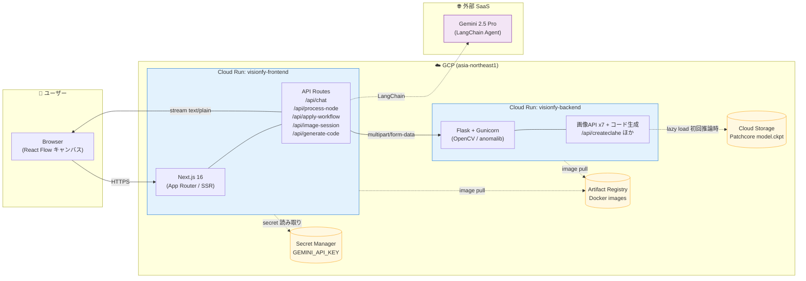

# 01. 全体アーキテクチャ

Visionfy Demo は **ノードベースの画像処理ワークフローアプリ** に **AI チャットアシスタント** を組み合わせた SPA です。
ブラウザ → Next.js（BFF）→ Flask（画像処理）／Gemini（AI）の 2 系統に分かれます。

## システム構成図（コンテナレベル）

## 補足

- **2 つの独立サービス**: フロント／バックエンドはそれぞれ別の Cloud Run サービスとして動く。`API_BASE_URL` 環境変数で結合され、Terraform が `cloudrun.tf` で動的注入する。
- **BFF パターン**: ブラウザは Flask に直接話さない。Next.js の API Routes が **唯一の入り口** で、Gemini API キーや GCP 認証はすべてサーバー側に閉じる（Two-hop proxy）。
- **2 系統のデータフロー**:
  - 画像処理: 同期 (`multipart/form-data` → `image/jpeg`)
  - AI チャット: ストリーミング (`text/plain` の `ReadableStream`、SSE ではない)
- **ストレージ**:
  - 推論モデル (`model.ckpt`) は GCS に置き、Backend が初回 `model_inference` リクエスト時に遅延ロード。
  - ワークフロー履歴は **ブラウザの localStorage**（バックエンド DB なし）。最大 20 件。
- **デフォルトリージョン**: `asia-northeast1`（東京）。

## さらに詳しく

- 技術スタックの詳細 → [02-tech-stack.md](./02-tech-stack.md)
- 画像処理のシーケンス → [03-image-processing-flow.md](./03-image-processing-flow.md)
- AI チャットのシーケンス → [04-ai-chat-flow.md](./04-ai-chat-flow.md)
- インフラ／デプロイ詳細 → [08-infrastructure-deployment.md](./08-infrastructure-deployment.md)
