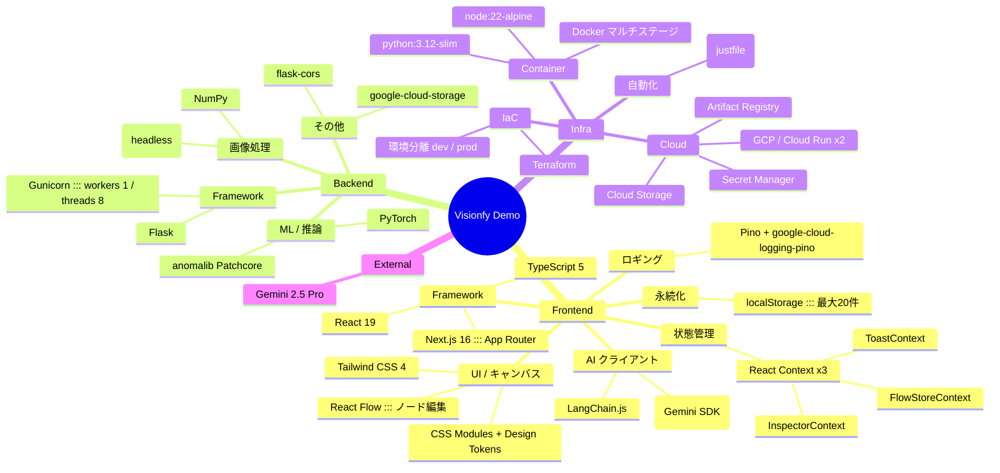

# 02. 技術スタック

採用している主要ライブラリ／フレームワークを **レイヤー別** にマインドマップで一覧化します。
バージョンは執筆時点（`package.json` / `requirements.txt` 参照）のもの。

## 技術スタック・マインドマップ

## レイヤー別ハイライト

### Frontend
- **Next.js 16 App Router**: API Routes が BFF として全外部通信を仲介。SSR/CSR 混在で、`app/page.tsx` は **ハイドレーション完了まで `null` を返す**（`window` 依存の localStorage 同期読みのため）。
- **React Flow**: ノード／エッジ管理。接続制約は `getConnectionConstraintError` で **1 入力 1 出力** を強制（分岐不可）。
- **Tailwind 4 + CSS Modules**: グローバルはトークン化（`frontend/lib/styles/`）、コンポーネント固有スタイルは `.module.css`。ハードコード値禁止、ダークモードは `prefers-color-scheme` で自動切替。
- **LangChain.js + Gemini SDK**: サーバー側のみで使用。`import type` でクライアントバンドルへの混入を防いでいる。

### Backend
- **Flask + Gunicorn**: 単一プロセス×8 スレッド。OpenCV は CPU バウンドだが GIL フレンドリーなので効率的。
- **opencv-python-headless**: 実行に `libglib2.0-0` / `libgl1` / `libxcb1` の OS パッケージが必要（Dockerfile に明記）。
- **anomalib Patchcore**: 異常検知モデル。チェックポイントは GCS から **遅延ロード**（初回 100 秒以内のスタートアッププローブで吸収）。

### Infra
- **Terraform**: dev / prod は `.tf` を共有し `*.tfvars` と `*.tfstate` のみで切り替え。`just tf-plan <env>` 経由が推奨。
- **Cloud Run**: フロント (1 CPU / 512Mi / max 5)・バックエンド (2 CPU / 4Gi / max 3)。両方 `min_instance_count = 0`（コールドスタート許容）。
- **`just`**: `justfile` がデプロイ・ローカル起動の標準窓口。生 `terraform` を叩く際の `-var-file` / `-state` 忘れを防ぐ。

## ファイル所在

| 領域 | 主な定義ファイル |
|------|----------------|
| Node 依存 | [frontend/package.json](../../frontend/package.json) |
| Python 依存 | [backend/requirements.txt](../../backend/requirements.txt) |
| デザイントークン | [frontend/lib/styles/](../../frontend/lib/styles/) |
| Cloud Run 定義 | [terraform/cloudrun.tf](../../terraform/cloudrun.tf) |
| ビルド／起動コマンド | [justfile](../../justfile) |
