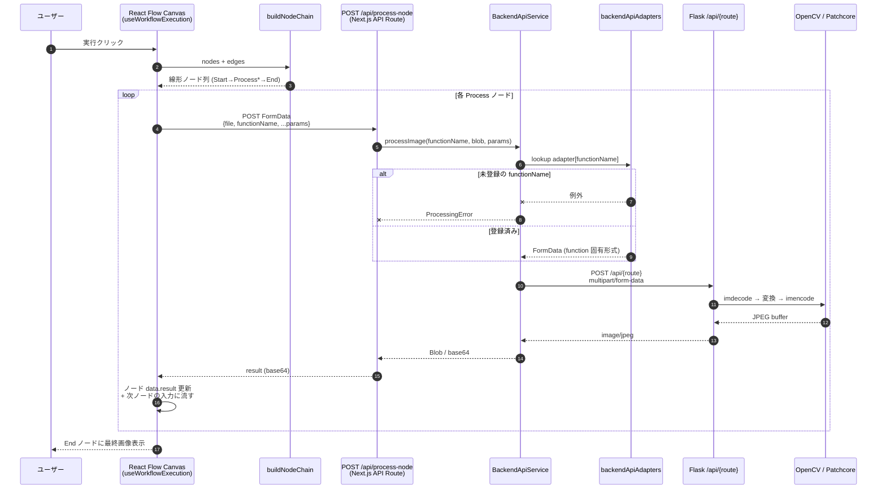

# 03. 画像処理のデータフロー

ユーザーが「実行」ボタンを押してから 1 ノード分の処理結果が画面に戻るまでの流れ。
**汎用ディスパッチ → アダプタ → Flask 個別ルート** という三段構えで、新関数追加時の変更箇所が局所化されている。

## シーケンス図

## 補足

### 三段ディスパッチの意義
- **`/api/process-node`** は **汎用**。新関数を足してもこのルートは変更不要。
- **`backendApiAdapters.ts`** が `functionName` ごとに **FormData の形** を組み立てる（`gaussianblur` は `ksizeX/Y` を別フィールドに分けるなど）。
- **Flask 側のルート名は別物**: `gaussianblur` → `/api/gaussian_blur`（typo 風だが意図的・固定）。アダプタ層がこのマッピングを吸収する。

### multipart 統一
- 画像は `file` フィールド、パラメータは文字列フィールド。
- 出力は **入力フォーマット問わず常に JPEG**。PNG の透過は失われる。
- 大きさ上限は `MAX_CONTENT_LENGTH`（デフォルト 16MB）、超過時は 413 を `FILE_TOO_LARGE` で返却。

### 関数ごとの落とし穴
- **CLAHE**: デコード時に `flags=0` で **グレースケール強制**（カラー入力でも gray 化）。
- **GaussianBlur**: 偶数 `ksize` は **バックエンドで +1**（フロントは生値を送る）。`ksize=0` は sigma から自動計算。
- **Grayscale**: `enableThreshold=false` なら `threshold` フィールドを **そもそも送らない**。
- **RestoreBrightness**: `value` は **減算**。デフォルト `-30` → 30 単位明るくなる（命名と逆向き）。
- **RestoreContrast**: `1/gamma` を LUT 適用（フロントで 1.7 を送ると 1/1.7 が掛かる）。

### 実行トラバーサル
- `useWorkflowExecution` → `buildNodeChain`（ループ検出付き）が **線形チェーン** を組む。
- End ノードが未接続でも、末端 Process の `out-edge` が無ければ **黙って終了**（エラーにならず最後の結果を返す）。
- 失敗ノード ID は `ProcessingError.nodeId` 優先、なければ `currentNodeId` フォールバック（`ValidationError` は `nodeId` を持たない）。

## 新関数追加チェックリスト（5 ステップ）

1. **型・メタデータ**: [`frontend/types/processFunctionBase.ts`](../../frontend/types/processFunctionBase.ts) の `PROCESS_FUNCTIONS_BASE` に追加 → UI フォーム自動生成。
2. **アダプタ**: [`frontend/lib/backendApiAdapters.ts`](../../frontend/lib/backendApiAdapters.ts) にビルダー関数 + 登録。
3. **Backend モジュール**: `backend/src/api/<func>/main.py` に `@dataclass(frozen=True)` + `_parse_params` + 処理関数。
4. **ルート登録**: [`backend/src/main.py`](../../backend/src/main.py) に `@image_endpoint(...)` 付きルート追加。
5. **コード生成対応**: `backend/src/api/generate_code/main.py` の `SUPPORTED_FUNCTIONS` / `FUNCTION_DEFS` / `_build_call_code` の **3 箇所** 追記（忘れると黙ってスキップ）。

詳細: [docs/features/API.md](../features/API.md), [.claude/rules/backend-api.md](../../.claude/rules/backend-api.md)
