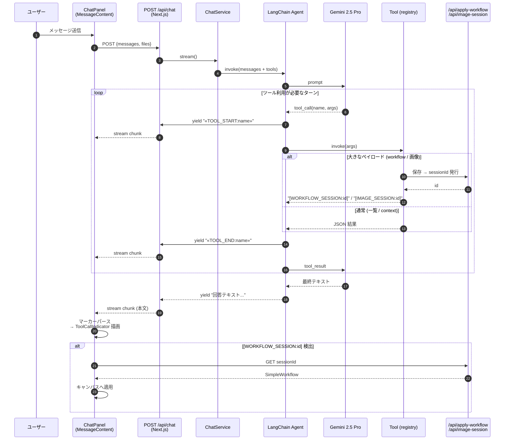

# 04. AI チャットのストリーミングとツール

Gemini 2.5 Pro + LangChain Agent ベース。**`text/plain` の `ReadableStream`** にツール呼び出しマーカーを差し込んで進行を可視化する独自プロトコルが核心。

## メッセージング・シーケンス

## 補足

### ストリーム形式の特徴
- **SSE ではなく `text/plain` の `ReadableStream`**。中途エラーは同一ストリームにテキスト追加し HTTP 200 を維持する → クライアント側は失敗を HTTP ステータスで判別できない（本文を見るしかない）。
- **マーカー** `<<TOOL_START:name>>` / `<<TOOL_END:name>>` がプロトコル。フロントの `MessageContent.tsx` がパースして `ToolCallIndicator` を描画する。
- **Two-hop proxy**: ブラウザは Gemini を直接呼ばない。`GEMINI_API_KEY` はサーバー側のみ。

### ツールレジストリ
- `frontend/lib/tools/registry.ts` の `TOOL_REGISTRY` にエントリを追加すれば新ツールが導入できる（`factory` + 任意の `isEnabled`）。

| Tool | 用途 | 実装 |
|------|------|------|
| `get_available_nodes` | 利用可能関数一覧 + デフォルト | [availableNodesTool.ts](../../frontend/lib/tools/availableNodesTool.ts) |
| `get_workflow_context` | 現キャンバスの構成・実行結果 | [workflowContextTool.ts](../../frontend/lib/tools/workflowContextTool.ts) |
| `generate_workflow` | SimpleWorkflow をキャンバスへ適用 | [generateWorkflowTool.ts](../../frontend/lib/tools/generateWorkflowTool.ts) |
| `get_image` | 入力／中間／結果画像を AI に渡す | [getImageTool.ts](../../frontend/lib/tools/getImageTool.ts) |

### セッションベース受け渡し
大きなペイロード（生成ワークフロー JSON・base64 画像）を **ストリームに直接乗せない** ために、サーバー側で保存しマーカーだけ返す:
- `[WORKFLOW_SESSION:id]` → `/api/apply-workflow?id=...` で取得 → キャンバス適用
- `[IMAGE_SESSION:id]` → `/api/image-session?id=...` で取得 → 次ターンで AI に渡す

### スレッドとプロンプト
- **localStorage 永続化**（[`chatStorageService.ts`](../../frontend/lib/chatStorageService.ts)）。**画像 base64 は保存時に剥がす**（容量爆発防止）。
- システムプロンプトは [`chatPrompts.ts`](../../frontend/lib/chatPrompts.ts) + `buildImageContext()` で動的合成。ユーザーがカスタム上書き可能。
- `PROCESS_FUNCTIONS_BASE` が **AI プロンプトと `get_available_nodes` の両方** の情報源 → 新関数を足せば自動でツールにも反映。

詳細: [docs/features/AI.md](../features/AI.md), [.claude/rules/ai-chat.md](../../.claude/rules/ai-chat.md), [frontend/lib/tools/README.md](../../frontend/lib/tools/README.md)
