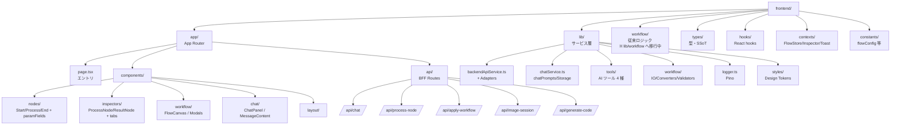
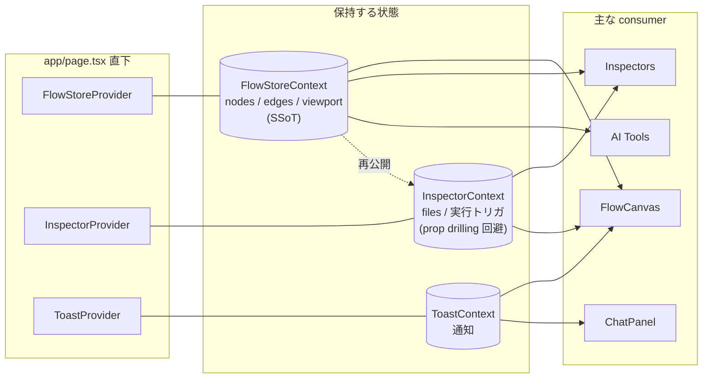

# 05. フロントエンド構成

`frontend/` ディレクトリの責務分担と、主要レイヤー間の依存関係。
**3 つの Context** がアプリ全体の状態を支え、**`lib/`** が外部 I/O と純粋ロジックを集約する。

## ディレクトリ構成（要約）

## 状態管理レイヤー（3 つの Context）

## 主要モジュール責務一覧

| 層 | パス | 役割 |
|----|------|------|
| **エントリ** | `app/page.tsx` | `isHydrated` で SSR/CSR 切替、Provider ツリー組み立て |
| **キャンバス** | `app/components/workflow/FlowCanvas.tsx` | React Flow ラッパー、ノード削除時のエッジ手動掃除 |
| **ノード UI** | `app/components/nodes/` | Start/Process/End + 5 種 paramFields（Boolean/Number/Select/Text/Tuple） |
| **インスペクタ** | `app/components/inspectors/` | 関数選択・パラメータ編集・実行履歴・Before/After 比較 |
| **チャット UI** | `app/components/chat/` | ストリーミング描画、ツールマーカー解析、画像添付 |
| **BFF** | `app/api/*/route.ts` | サーバー専用キー保持、Flask との橋渡し |
| **API サービス** | `lib/backendApiService.ts` | Browser/Node 両対応の base64↔Blob、レスポンス正規化 |
| **AI サービス** | `lib/chatService.ts` | LangChain Agent + ツール組み立て + ストリーム生成 |
| **ワークフロー IO** | `lib/workflow/io/WorkflowIOService.ts` | 全インポート／エクスポートの統一窓口 |
| **型 SSoT** | `types/processFunctionBase.ts` | `PROCESS_FUNCTIONS_BASE` から UI/AI/デフォルトを派生 |
| **デザイントークン** | `lib/styles/` | カラー・余白・影・z-index・タイポグラフィ |

## 非自明な振る舞い（抜粋）

- **SSR ハイドレーション**: `app/page.tsx` は `isHydrated=true` まで `null` を返す。サーバー側で localStorage 読みが空配列、ブラウザでは中身ありになり mismatch するのを防ぐため。
- **`fitView` の上書き**: スナップショット復元時の `viewport` 位置は初回マウントの `fitView` が上書きする。
- **`base64ToBlob` の二経路**: `BackendApiService` がサーバーでも動くため、Node (`Buffer`) と Browser (`atob`/`FileReader`) の両方を持つ。
- **`import type` でバンドル隔離**: チャット系の型を取るときは `import type` を使い、LangChain 依存がクライアントバンドルへ混入しないようにしている。

詳細: [.claude/rules/frontend-internals.md](../../.claude/rules/frontend-internals.md), [.claude/rules/workflow-canvas.md](../../.claude/rules/workflow-canvas.md)
