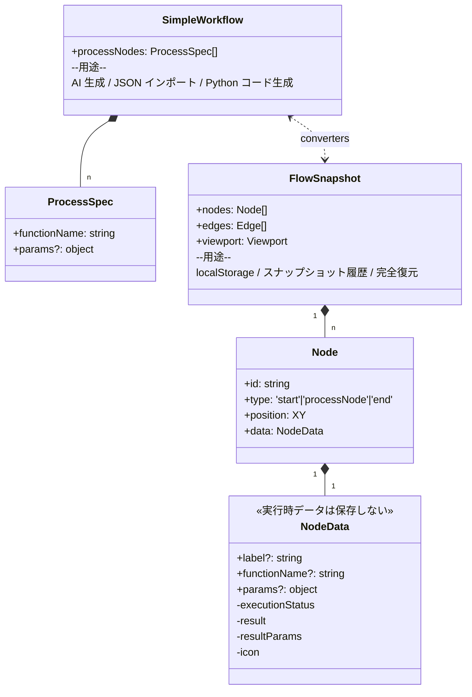
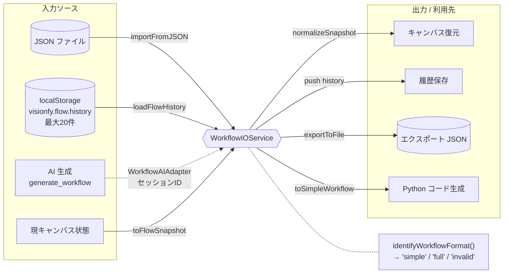

# 07. ワークフローのデータモデル

ワークフローは **2 つの JSON 形式** を持ち、用途によって使い分ける。
すべての I/O は `WorkflowIOService` に集約され、ファイル／localStorage／AI ツールの間を統一的に行き来する。

## 2 つの形式の関係

## I/O 経路の集中

## 補足

### 形式の使い分け
| 形式 | 内容 | こんなときに使う |
|------|------|----------------|
| **SimpleWorkflow** | `processNodes: [{functionName, params?}]` | AI 生成、ユーザー手入力、Python コード生成（最小限） |
| **FlowSnapshot** | `nodes` / `edges` / `viewport` | localStorage、履歴復元（位置・接続の完全保存） |

`identifyWorkflowFormat()` が入力 JSON を自動判定 → `'simple'` / `'full'` / `'invalid'`。

### 保存時に剥がされるランタイムデータ
シリアライザは process ノードについて `label` / `functionName` / `params` のみ取り、以下を **削除** する:
- `executionStatus` — 実行ステータス
- `result` — 結果画像 base64
- `resultParams` — 実行時に使った params のスナップショット
- `icon` — 動的に派生可能なので保存不要

> `params` と `resultParams` は別フィールド。実行履歴表示で `resultParams ?? params` を使うことで「再実行前は前回値、編集後は新値」が表示できる。

### 永続化の重要事項
- ストレージキー: `visionfy.flow.history`、**最大 20 件**（古いものから自動削除、新しいものが先頭）。
- スナップショット ID: `snapshot-${Date.now()}`（同一 ms 衝突リスクあり）。
- `normalizeSnapshot()` が後方互換変換を実行（`type: 'custom'` → `type: 'processNode'` 等）。

### AI との橋渡し
`generate_workflow` ツールは SimpleWorkflow JSON を **ストリームに直接乗せない**:
1. `WorkflowAIAdapter` が `/api/apply-workflow` に保存 → セッション ID 発行
2. ストリームには `[WORKFLOW_SESSION:id]` マーカーだけ流す
3. `ChatPanel` がマーカー検出 → セッション API で取得 → キャンバスへ適用

### Python コード生成
`GenerateCodeModal` から現キャンバスを SimpleWorkflow に変換し、`POST /api/generate-code` → Flask `POST /api/generate_code` → スタンドアロン Python スクリプトが返る。`model_inference` ステップは生成不可なのでコメントとしてスキップされる。

### 移行中の旧コード
`frontend/workflow/workflowConverter.ts` / `workflowValidator.ts` は **非推奨ラッパー**。新規コードは `frontend/lib/workflow/` を使う。

詳細: [docs/features/WORKFLOW_PERSISTENCE.md](../features/WORKFLOW_PERSISTENCE.md), [.claude/rules/workflow-persistence.md](../../.claude/rules/workflow-persistence.md)
