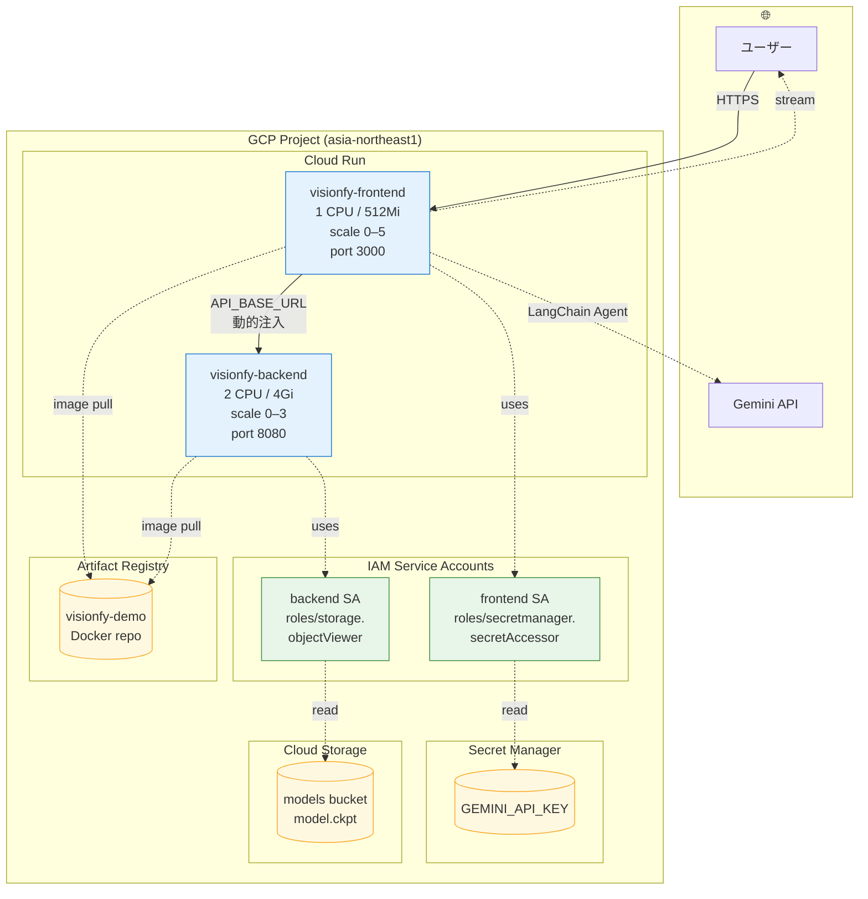
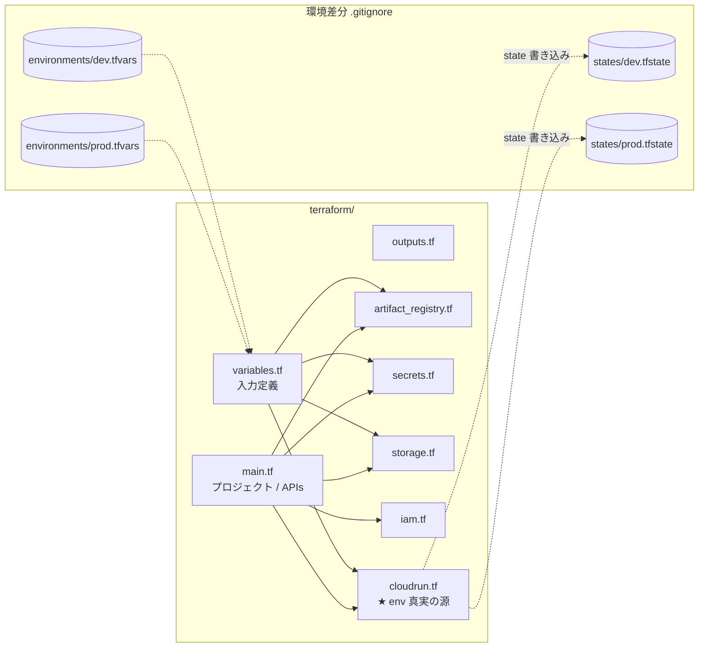
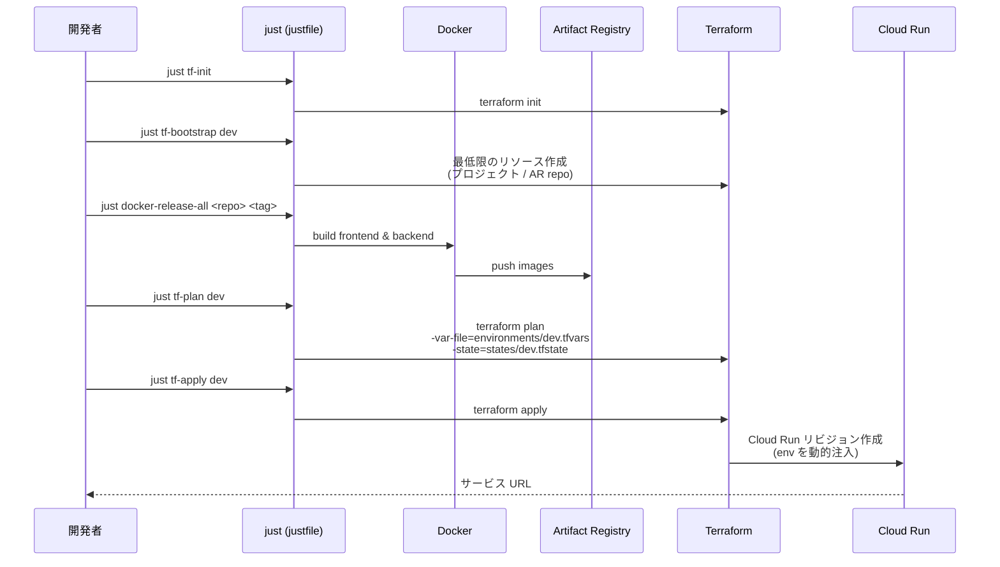

# 08. インフラとデプロイ

GCP 上に Terraform でプロビジョニング。**Cloud Run × 2** が中心で、Artifact Registry / Secret Manager / Cloud Storage がそれを支える。
**Docker イメージのビルド／プッシュは `terraform apply` の前** に手動で行う必要がある（Cloud Run が参照するため）。

## GCP リソース構成図

## Terraform ファイル構成

## デプロイフロー

## 補足

### 環境分離の仕組み
- dev / prod は **同一の `.tf` ファイル群** を共有し、以下のみで切り替え:
  - 変数値: `terraform/environments/<env>.tfvars`（`-var-file` で指定）
  - state: `terraform/states/<env>.tfstate`（`-state` で指定）
- `environments/*.tfvars` と `states/*.tfstate` は **`.gitignore` 対象**。`*.tfvars.example` を見れば dev/prod の差分が一目でわかる。
- 生 `terraform` を叩く場合は **必ず `-var-file` と `-state` を両方指定**。忘れると別環境を破壊するリスクがあるので `just` 経由が推奨。

### Cloud Run 個別仕様
- **`visionfy-frontend`** (port 3000): Secret Manager から `GEMINI_API_KEY` を取得。`API_BASE_URL` がバックエンドの URL に **動的注入** される（`google_cloud_run_v2_service.backend.uri`）。
- **`visionfy-backend`** (port 8080): 初回推論時に GCS から `model.ckpt` を **遅延ロード**（最大 100 秒の `/health` スタートアッププローブで吸収、`failure_threshold = 6 × period 15s`）。
- 両サービスとも `allUsers` 公開（パブリック）。`min_instance_count = 0` でコールドスタート許容。

### Docker 詳細
| イメージ | ベース | ステージ | 備考 |
|---------|------|--------|------|
| frontend | `node:22-alpine` | deps → builder → runner | Next.js standalone 出力、非 root |
| backend | `python:3.12-slim` | deps → runtime | `libglib2.0-0` / `libgl1` / `libxcb1` が必須（OpenCV 用） |

backend は `--workers 1 --threads 8 --timeout 0` で起動 → OpenCV は CPU バウンドだが GIL フレンドリーなのでこの設定が効率的。timeout は Cloud Run 側に任せる。

### 環境変数の真実の源
- **Cloud Run の env**: [`terraform/cloudrun.tf`](../../terraform/cloudrun.tf) が SoT。
- **ローカル**: 各サービスの `.env.example` を `.env` にコピー（[`backend/.env.example`](../../backend/.env.example) / [`frontend/.env.example`](../../frontend/.env.example)）。
- **横断マトリクス**: [docs/features/ENVIRONMENT.md](../features/ENVIRONMENT.md) に local / cloud / both のスコープが整理されている。

### よく使うコマンド
| コマンド | 説明 |
|---------|------|
| `just tf-init` | Terraform 初期化 |
| `just tf-bootstrap <env>` | プロジェクト / AR repo のみ先行作成 |
| `just docker-release-all <repo> <tag>` | 両イメージビルド & push |
| `just tf-plan <env>` | dry-run（環境別 tfvars/state を自動指定） |
| `just tf-apply <env>` | 本番適用 |

詳細: [terraform/README.md](../../terraform/README.md), [.claude/rules/infrastructure.md](../../.claude/rules/infrastructure.md), [.claude/rules/commands.md](../../.claude/rules/commands.md)
